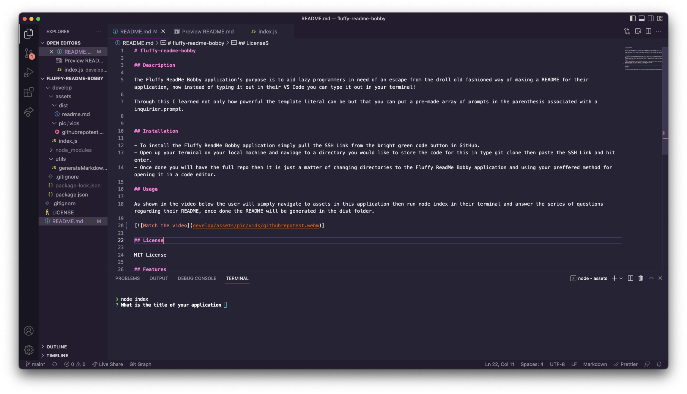

# fluffy-readme-bobby

## Description

The Fluffy ReadMe Bobby application's purpose is to aid lazy programmers in need of an escape from the droll old fashioned way of making a README for their application, now instead of typing it out in their VS Code you can type it out in your terminal!

Through this I learned not only how powerful the template literal can be but that you can put a pre-made array of prompts in the parenthesis associated with a inquirier.prompt.

## Installation

- To install the Fluffy ReadMe Bobby application simply pull the SSH Link from the bright green code button in GitHub.
- Open up your terminal on your local machine and naviage to a directory you would like to store the code for this in type git clone then paste the SSH Link and hit enter.
- Once done you will have the full repo then it is just a matter of changing directories to the Fluffy ReadMe Bobby application and using your preffered method for opening it in a code editor.

## Usage

As shown in the video below the user will simply navigate to assets in this application then run node index in their terminal and answer the series of questions regarding their README, once done the README will be generated in the dist folder.

## License

MIT License

## Features

- The user can define their application title, description, installation instructions, contributions section, license type with a badge, tests they have written for the app and their git hub username right into the terminal which will then generate a working README for them.